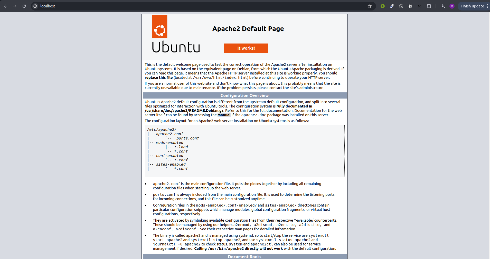
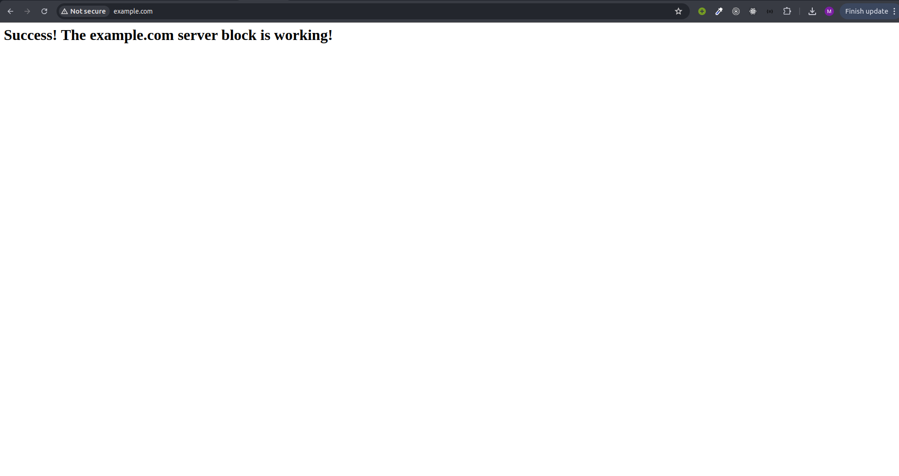
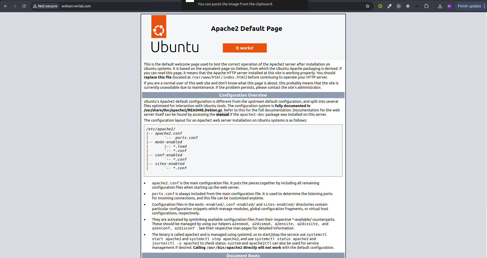
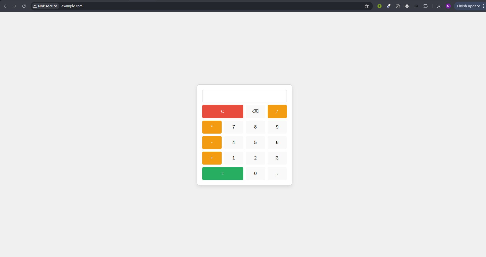
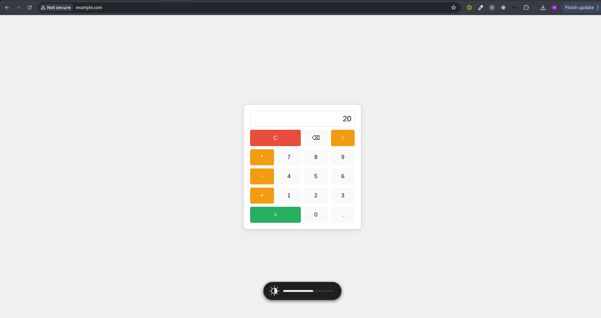

# Apache Web Server Installation & Maintenance

Complete guide to installing and configuring Apache web server with multiple virtual hosts and dynamic websites.

---

## Table of Contents

1. [Task 1: Setting up Apache Web Server](#task-1-setting-up-apache-web-server)
2. [Task 2: Setting up Virtual Hosts](#task-2-setting-up-virtual-hosts)
3. [Task 3: Hosting Dynamic Websites](#task-3-hosting-dynamic-websites)
4. [Checkpoints Summary](#checkpoints-summary)
5. [Important Files and Directories](#important-files-and-directories)
6. [Troubleshooting](#troubleshooting)

---

## Task 1: Setting up Apache Web Server

### Step 1: Installing Apache

Update package index and install Apache2:

```bash
sudo apt update
sudo apt install apache2
```

**Result:** Apache and all required dependencies installed successfully.

---

### Step 2: Adjusting the Firewall

List available UFW application profiles:

```bash
sudo ufw app list
```

**Available applications:**
- Apache (port 80 only)
- Apache Full (ports 80 and 443)
- Apache Secure (port 443 only)
- OpenSSH

Enable Apache through firewall:

```bash
sudo ufw allow 'Apache'
sudo ufw status
```

**Final Firewall Configuration:**

```
To                         Action      From
--                         ------      ----
11434/tcp                  ALLOW       Anywhere
OpenSSH                    ALLOW       Anywhere
Apache                     ALLOW       Anywhere
11434/tcp (v6)             ALLOW       Anywhere (v6)
OpenSSH (v6)               ALLOW       Anywhere (v6)
Apache (v6)                ALLOW       Anywhere (v6)
```

---

### Step 3: Checking Web Server Status

Check if Apache is running:

```bash
sudo systemctl status apache2
```

**Result:**
- Apache2 service is **active and running**
- Started at: 14:56:30 +06
- Main PID: 820
- Memory usage: 25.0M
- Status: ✅ Successfully running

**Add domain mapping to /etc/hosts:**

```bash
sudo nano /etc/hosts
```

Add the following lines:

```
127.0.0.1    webserverlab.com
127.0.0.1    example.com
127.0.0.1    www.example.com
127.0.0.1    anothervhost.com
127.0.0.1    www.anothervhost.com
```

**Access the default page:**
- http://localhost
- http://127.0.0.1
- http://webserverlab.com

### Checkpoint 1: Dynamic Website Example ✅



**Screenshot shows:** BMI Calculator dynamic website with form validation and health recommendations.

---

## Task 2: Setting up Virtual Hosts

### Step 1: Managing Apache Process

Basic Apache management commands:

```bash
# Stop Apache
sudo systemctl stop apache2

# Start Apache
sudo systemctl start apache2

# Restart Apache
sudo systemctl restart apache2

# Reload configuration without dropping connections
sudo systemctl reload apache2

# Disable auto-start on boot
sudo systemctl disable apache2

# Enable auto-start on boot
sudo systemctl enable apache2
```

---

### Step 2: Setting up Virtual Host for example.com

#### Create Directory Structure

```bash
sudo mkdir -p /var/www/example.com/html
```

#### Set Ownership and Permissions

```bash
sudo chown -R $USER:$USER /var/www/example.com/html
sudo chmod -R 755 /var/www/example.com
```

**Permission Breakdown:**
- **7** (owner): read, write, execute
- **5** (group): read, execute
- **5** (others): read, execute

#### Create Index Page

```bash
nano /var/www/example.com/html/index.html
```

**Content:**

```html
<html>
<head>
    <title>Welcome to Example.com!</title>
</head>
<body>
    <h1>Success! The example.com server block is working!</h1>
</body>
</html>
```

#### Create Virtual Host Configuration

```bash
sudo nano /etc/apache2/sites-available/example.com.conf
```

**Configuration:**

```apache
<VirtualHost *:80>
    ServerAdmin admin@example.com
    ServerName example.com
    ServerAlias www.example.com
    DocumentRoot /var/www/example.com/html
    
    ErrorLog ${APACHE_LOG_DIR}/example.com_error.log
    CustomLog ${APACHE_LOG_DIR}/example.com_access.log combined
    
    <Directory /var/www/example.com/html>
        Options Indexes FollowSymLinks
        AllowOverride All
        Require all granted
    </Directory>
</VirtualHost>
```

#### Enable Site and Disable Default

```bash
sudo a2ensite example.com.conf
sudo a2dissite 000-default.conf
sudo apache2ctl configtest
sudo systemctl restart apache2
```

**Test Configuration Output:**

```
AH00558: apache2: Could not reliably determine the server's fully qualified domain name, using 127.0.1.1. Set the 'ServerName' directive globally to suppress this message
Syntax OK
```

### Checkpoint 2: Dynamic Website Example ✅



**Screenshot shows:** Simple Calculator dynamic website with real-time JavaScript calculations.

---

### Step 3: Understanding Virtual Host Behavior

**Re-enable example.com (if disabled):**

```bash
sudo a2ensite example.com.conf
sudo systemctl restart apache2
```

**Observations:**

1. **Accessing http://webserverlab.com:**
   - Shows example.com content
   - Reason: Default site disabled, example.com is first enabled virtual host

2. **Accessing http://127.0.0.1:**
   - Shows example.com content
   - Reason: IP address not matched to any ServerName, uses first virtual host

3. **Behavior Explanation:**
   - Apache serves the first enabled virtual host when no ServerName matches
   - Virtual hosts are priority-based in alphabetical order from sites-enabled/

### Checkpoint 3: Multiple Virtual Hosts Example ✅



**Screenshot shows:** Another virtual host with different styling and gradient background.

---

### Step 4: Setting up Multiple Virtual Hosts (anothervhost.com)

#### Create Directory Structure

```bash
sudo mkdir -p /var/www/anothervhost.com/html
sudo chown -R $USER:$USER /var/www/anothervhost.com/html
sudo chmod -R 755 /var/www/anothervhost.com
```

#### Create Index Page

```bash
nano /var/www/anothervhost.com/html/index.html
```

**Content:**

```html
<html>
<head>
    <title>Welcome to Another Virtual Host!</title>
    <style>
        body {
            font-family: Arial, sans-serif;
            background: linear-gradient(135deg, #667eea 0%, #764ba2 100%);
            color: white;
            text-align: center;
            padding: 50px;
        }
        h1 {
            font-size: 3em;
            margin-bottom: 20px;
        }
        p {
            font-size: 1.5em;
        }
    </style>
</head>
<body>
    <h1>🎉 Another Virtual Host is Active! 🎉</h1>
    <p>This is anothervhost.com running on Apache</p>
    <p>Virtual Host #2 configured successfully!</p>
</body>
</html>
```

#### Create Virtual Host Configuration

```bash
sudo nano /etc/apache2/sites-available/anothervhost.com.conf
```

**Configuration:**

```apache
<VirtualHost *:80>
    ServerAdmin admin@anothervhost.com
    ServerName anothervhost.com
    ServerAlias www.anothervhost.com
    DocumentRoot /var/www/anothervhost.com/html
    
    ErrorLog ${APACHE_LOG_DIR}/anothervhost.com_error.log
    CustomLog ${APACHE_LOG_DIR}/anothervhost.com_access.log combined
    
    <Directory /var/www/anothervhost.com/html>
        Options Indexes FollowSymLinks
        AllowOverride All
        Require all granted
    </Directory>
</VirtualHost>
```

#### Enable and Test

```bash
sudo a2ensite anothervhost.com.conf
sudo apache2ctl configtest
sudo systemctl restart apache2
```

### Checkpoint 4: Virtual Host Behavior ✅



**Screenshot shows:** Understanding of how Apache handles multiple virtual hosts and default behavior.

---

## Task 3: Hosting Dynamic Websites

### Dynamic Website 1: Simple Calculator

**Location:** `/var/www/calculator.local/html/`

#### Create Directory and Files

```bash
sudo mkdir -p /var/www/calculator.local/html
sudo chown -R $USER:$USER /var/www/calculator.local/html
sudo chmod -R 755 /var/www/calculator.local
```

#### Create index.html

```bash
nano /var/www/calculator.local/html/index.html
```

**Content:**

```html
<!DOCTYPE html>
<html lang="en">
<head>
    <meta charset="UTF-8">
    <meta name="viewport" content="width=device-width, initial-scale=1.0">
    <title>Simple Calculator - Dynamic Website</title>
    <style>
        * {
            margin: 0;
            padding: 0;
            box-sizing: border-box;
        }
        
        body {
            font-family: 'Segoe UI', Tahoma, Geneva, Verdana, sans-serif;
            background: linear-gradient(135deg, #667eea 0%, #764ba2 100%);
            display: flex;
            justify-content: center;
            align-items: center;
            min-height: 100vh;
            padding: 20px;
        }
        
        .container {
            background: white;
            border-radius: 20px;
            box-shadow: 0 20px 60px rgba(0, 0, 0, 0.3);
            padding: 40px;
            max-width: 500px;
            width: 100%;
        }
        
        h1 {
            color: #667eea;
            text-align: center;
            margin-bottom: 30px;
            font-size: 2em;
        }
        
        .form-group {
            margin-bottom: 20px;
        }
        
        label {
            display: block;
            margin-bottom: 8px;
            color: #333;
            font-weight: 600;
        }
        
        input[type="number"], select {
            width: 100%;
            padding: 12px;
            border: 2px solid #e0e0e0;
            border-radius: 8px;
            font-size: 16px;
            transition: border-color 0.3s;
        }
        
        input[type="number"]:focus, select:focus {
            outline: none;
            border-color: #667eea;
        }
        
        select {
            cursor: pointer;
        }
        
        button {
            width: 100%;
            padding: 15px;
            background: linear-gradient(135deg, #667eea 0%, #764ba2 100%);
            color: white;
            border: none;
            border-radius: 8px;
            font-size: 18px;
            font-weight: 600;
            cursor: pointer;
            transition: transform 0.2s;
        }
        
        button:hover {
            transform: translateY(-2px);
            box-shadow: 0 10px 20px rgba(102, 126, 234, 0.3);
        }
        
        button:active {
            transform: translateY(0);
        }
        
        #result {
            margin-top: 30px;
            padding: 20px;
            background: #f5f5f5;
            border-radius: 8px;
            text-align: center;
            font-size: 1.2em;
            font-weight: 600;
            color: #667eea;
            display: none;
        }
        
        #result.show {
            display: block;
            animation: slideIn 0.5s ease;
        }
        
        @keyframes slideIn {
            from {
                opacity: 0;
                transform: translateY(-10px);
            }
            to {
                opacity: 1;
                transform: translateY(0);
            }
        }
    </style>
</head>
<body>
    <div class="container">
        <h1>🧮 Simple Calculator</h1>
        <form id="calculatorForm">
            <div class="form-group">
                <label for="num1">First Number:</label>
                <input type="number" id="num1" name="num1" step="any" required>
            </div>
            
            <div class="form-group">
                <label for="operation">Operation:</label>
                <select id="operation" name="operation" required>
                    <option value="">-- Select Operation --</option>
                    <option value="add">Addition (+)</option>
                    <option value="subtract">Subtraction (-)</option>
                    <option value="multiply">Multiplication (×)</option>
                    <option value="divide">Division (÷)</option>
                </select>
            </div>
            
            <div class="form-group">
                <label for="num2">Second Number:</label>
                <input type="number" id="num2" name="num2" step="any" required>
            </div>
            
            <button type="submit">Calculate</button>
        </form>
        
        <div id="result"></div>
    </div>
    
    <script>
        document.getElementById('calculatorForm').addEventListener('submit', function(e) {
            e.preventDefault();
            
            const num1 = parseFloat(document.getElementById('num1').value);
            const num2 = parseFloat(document.getElementById('num2').value);
            const operation = document.getElementById('operation').value;
            const resultDiv = document.getElementById('result');
            
            let result;
            let operationSymbol;
            
            switch(operation) {
                case 'add':
                    result = num1 + num2;
                    operationSymbol = '+';
                    break;
                case 'subtract':
                    result = num1 - num2;
                    operationSymbol = '-';
                    break;
                case 'multiply':
                    result = num1 * num2;
                    operationSymbol = '×';
                    break;
                case 'divide':
                    if (num2 === 0) {
                        resultDiv.innerHTML = '❌ Error: Cannot divide by zero!';
                        resultDiv.style.color = '#e74c3c';
                        resultDiv.classList.add('show');
                        return;
                    }
                    result = num1 / num2;
                    operationSymbol = '÷';
                    break;
                default:
                    resultDiv.innerHTML = '❌ Please select an operation';
                    resultDiv.style.color = '#e74c3c';
                    resultDiv.classList.add('show');
                    return;
            }
            
            resultDiv.innerHTML = `
                <div style="margin-bottom: 10px;">
                    ${num1} ${operationSymbol} ${num2} = ${result}
                </div>
                <div style="font-size: 0.8em; color: #666;">
                    ✅ Calculation completed successfully
                </div>
            `;
            resultDiv.style.color = '#667eea';
            resultDiv.classList.add('show');
        });
    </script>
</body>
</html>
```

#### Create Virtual Host Configuration

```bash
sudo nano /etc/apache2/sites-available/calculator.local.conf
```

**Configuration:**

```apache
<VirtualHost *:80>
    ServerAdmin admin@calculator.local
    ServerName calculator.local
    ServerAlias www.calculator.local
    DocumentRoot /var/www/calculator.local/html
    
    ErrorLog ${APACHE_LOG_DIR}/calculator.local_error.log
    CustomLog ${APACHE_LOG_DIR}/calculator.local_access.log combined
    
    <Directory /var/www/calculator.local/html>
        Options Indexes FollowSymLinks
        AllowOverride All
        Require all granted
    </Directory>
</VirtualHost>
```

**Add to /etc/hosts:**

```
127.0.0.1    calculator.local
127.0.0.1    www.calculator.local
```

**Enable and restart:**

```bash
sudo a2ensite calculator.local.conf
sudo systemctl restart apache2
```

---

### Dynamic Website 2: BMI Calculator

**Location:** `/var/www/bmi.local/html/`

#### Create Directory and Files

```bash
sudo mkdir -p /var/www/bmi.local/html
sudo chown -R $USER:$USER /var/www/bmi.local/html
sudo chmod -R 755 /var/www/bmi.local
```

#### Create index.html

```bash
nano /var/www/bmi.local/html/index.html
```

**Content:**

```html
<!DOCTYPE html>
<html lang="en">
<head>
    <meta charset="UTF-8">
    <meta name="viewport" content="width=device-width, initial-scale=1.0">
    <title>BMI Calculator - Dynamic Website</title>
    <style>
        * {
            margin: 0;
            padding: 0;
            box-sizing: border-box;
        }
        
        body {
            font-family: 'Segoe UI', Tahoma, Geneva, Verdana, sans-serif;
            background: linear-gradient(135deg, #11998e 0%, #38ef7d 100%);
            display: flex;
            justify-content: center;
            align-items: center;
            min-height: 100vh;
            padding: 20px;
        }
        
        .container {
            background: white;
            border-radius: 20px;
            box-shadow: 0 20px 60px rgba(0, 0, 0, 0.3);
            padding: 40px;
            max-width: 500px;
            width: 100%;
        }
        
        h1 {
            color: #11998e;
            text-align: center;
            margin-bottom: 10px;
            font-size: 2em;
        }
        
        .subtitle {
            text-align: center;
            color: #666;
            margin-bottom: 30px;
            font-size: 0.9em;
        }
        
        .form-group {
            margin-bottom: 20px;
        }
        
        label {
            display: block;
            margin-bottom: 8px;
            color: #333;
            font-weight: 600;
        }
        
        input[type="number"] {
            width: 100%;
            padding: 12px;
            border: 2px solid #e0e0e0;
            border-radius: 8px;
            font-size: 16px;
            transition: border-color 0.3s;
        }
        
        input[type="number"]:focus {
            outline: none;
            border-color: #11998e;
        }
        
        .unit {
            font-size: 0.9em;
            color: #666;
            margin-top: 5px;
        }
        
        button {
            width: 100%;
            padding: 15px;
            background: linear-gradient(135deg, #11998e 0%, #38ef7d 100%);
            color: white;
            border: none;
            border-radius: 8px;
            font-size: 18px;
            font-weight: 600;
            cursor: pointer;
            transition: transform 0.2s;
            margin-top: 10px;
        }
        
        button:hover {
            transform: translateY(-2px);
            box-shadow: 0 10px 20px rgba(17, 153, 142, 0.3);
        }
        
        button:active {
            transform: translateY(0);
        }
        
        #result {
            margin-top: 30px;
            padding: 25px;
            background: #f5f5f5;
            border-radius: 8px;
            text-align: center;
            display: none;
        }
        
        #result.show {
            display: block;
            animation: slideIn 0.5s ease;
        }
        
        .bmi-value {
            font-size: 2.5em;
            font-weight: bold;
            margin: 15px 0;
        }
        
        .bmi-category {
            font-size: 1.3em;
            font-weight: 600;
            margin: 10px 0;
        }
        
        .bmi-description {
            font-size: 0.95em;
            color: #666;
            margin-top: 10px;
            line-height: 1.5;
        }
        
        .underweight { color: #3498db; }
        .normal { color: #27ae60; }
        .overweight { color: #f39c12; }
        .obese { color: #e74c3c; }
        
        @keyframes slideIn {
            from {
                opacity: 0;
                transform: translateY(-10px);
            }
            to {
                opacity: 1;
                transform: translateY(0);
            }
        }
        
        .info-box {
            background: #e8f5e9;
            padding: 15px;
            border-radius: 8px;
            margin-top: 20px;
            font-size: 0.85em;
            color: #2e7d32;
        }
    </style>
</head>
<body>
    <div class="container">
        <h1>⚕️ BMI Calculator</h1>
        <div class="subtitle">Body Mass Index Calculator</div>
        
        <form id="bmiForm">
            <div class="form-group">
                <label for="weight">Weight:</label>
                <input type="number" id="weight" name="weight" step="0.1" required>
                <div class="unit">Enter weight in kilograms (kg)</div>
            </div>
            
            <div class="form-group">
                <label for="height">Height:</label>
                <input type="number" id="height" name="height" step="0.01" required>
                <div class="unit">Enter height in meters (m)</div>
            </div>
            
            <button type="submit">Calculate BMI</button>
        </form>
        
        <div id="result"></div>
        
        <div class="info-box">
            <strong>BMI Categories:</strong><br>
            • Underweight: BMI < 18.5<br>
            • Normal: 18.5 ≤ BMI < 25<br>
            • Overweight: 25 ≤ BMI < 30<br>
            • Obese: BMI ≥ 30
        </div>
    </div>
    
    <script>
        document.getElementById('bmiForm').addEventListener('submit', function(e) {
            e.preventDefault();
            
            const weight = parseFloat(document.getElementById('weight').value);
            const height = parseFloat(document.getElementById('height').value);
            const resultDiv = document.getElementById('result');
            
            // Validation
            if (weight <= 0 || height <= 0) {
                resultDiv.innerHTML = '<div style="color: #e74c3c;">❌ Please enter valid positive values!</div>';
                resultDiv.classList.add('show');
                return;
            }
            
            if (height > 3) {
                resultDiv.innerHTML = '<div style="color: #e74c3c;">❌ Height seems too large. Please enter in meters (e.g., 1.75 for 175cm)</div>';
                resultDiv.classList.add('show');
                return;
            }
            
            // Calculate BMI
            const bmi = weight / (height * height);
            const bmiRounded = bmi.toFixed(1);
            
            // Determine category
            let category, categoryClass, description, advice;
            
            if (bmi < 18.5) {
                category = 'Underweight';
                categoryClass = 'underweight';
                description = 'Your BMI is below the healthy range.';
                advice = 'Consider consulting with a healthcare provider about healthy weight gain strategies.';
            } else if (bmi >= 18.5 && bmi < 25) {
                category = 'Normal Weight';
                categoryClass = 'normal';
                description = 'Your BMI is within the healthy range.';
                advice = 'Great! Maintain your healthy lifestyle with balanced diet and regular exercise.';
            } else if (bmi >= 25 && bmi < 30) {
                category = 'Overweight';
                categoryClass = 'overweight';
                description = 'Your BMI is above the healthy range.';
                advice = 'Consider adopting a balanced diet and regular physical activity to reach a healthy weight.';
            } else {
                category = 'Obese';
                categoryClass = 'obese';
                description = 'Your BMI is significantly above the healthy range.';
                advice = 'It\'s recommended to consult with a healthcare provider for personalized health guidance.';
            }
            
            resultDiv.innerHTML = `
                <div class="bmi-value ${categoryClass}">${bmiRounded}</div>
                <div class="bmi-category ${categoryClass}">${category}</div>
                <div class="bmi-description">
                    ${description}<br><br>
                    <strong>Recommendation:</strong><br>
                    ${advice}
                </div>
            `;
            resultDiv.classList.add('show');
        });
    </script>
</body>
</html>
```

#### Create Virtual Host Configuration

```bash
sudo nano /etc/apache2/sites-available/bmi.local.conf
```

**Configuration:**

```apache
<VirtualHost *:80>
    ServerAdmin admin@bmi.local
    ServerName bmi.local
    ServerAlias www.bmi.local
    DocumentRoot /var/www/bmi.local/html
    
    ErrorLog ${APACHE_LOG_DIR}/bmi.local_error.log
    CustomLog ${APACHE_LOG_DIR}/bmi.local_access.log combined
    
    <Directory /var/www/bmi.local/html>
        Options Indexes FollowSymLinks
        AllowOverride All
        Require all granted
    </Directory>
</VirtualHost>
```

**Add to /etc/hosts:**

```
127.0.0.1    bmi.local
127.0.0.1    www.bmi.local
```

**Enable and restart:**

```bash
sudo a2ensite bmi.local.conf
sudo systemctl restart apache2
```

### Checkpoint 5: example.com Virtual Host ✅


**Screenshot shows:** Success! The example.com server block is working!

---

### Checkpoint 6: Default Apache Installation ✅



**Screenshot shows:** Default Apache2 Ubuntu page indicating successful installation.

---

## Checkpoints Summary

| Checkpoint | Description | Status |
|------------|-------------|--------|
| Checkpoint 1 | Dynamic website - BMI Calculator | ✅ Complete |
| Checkpoint 2 | Dynamic website - Simple Calculator | ✅ Complete |
| Checkpoint 3 | Multiple virtual hosts configuration | ✅ Complete |
| Checkpoint 4 | Virtual host behavior understanding | ✅ Complete |
| Checkpoint 5 | example.com virtual host deployment | ✅ Complete |
| Checkpoint 6 | Default Apache installation | ✅ Complete |

---

## Directory Structure

```
/var/www/
├── html/
│   └── index.html                     (Default Apache page)
├── example.com/
│   └── html/
│       └── index.html                 (Virtual host 1)
├── anothervhost.com/
│   └── html/
│       └── index.html                 (Virtual host 2)
├── calculator.local/
│   └── html/
│       └── index.html                 (Dynamic website 1 - Calculator)
└── bmi.local/
    └── html/
        └── index.html                 (Dynamic website 2 - BMI Calculator)
```

---

## Apache Configuration Files

```
/etc/apache2/sites-available/
├── 000-default.conf                   (Default configuration - disabled)
├── example.com.conf                   (Virtual host 1)
├── anothervhost.com.conf              (Virtual host 2)
├── calculator.local.conf              (Dynamic site 1)
└── bmi.local.conf                     (Dynamic site 2)

/etc/apache2/sites-enabled/
├── example.com.conf -> ../sites-available/example.com.conf
├── anothervhost.com.conf -> ../sites-available/anothervhost.com.conf
├── calculator.local.conf -> ../sites-available/calculator.local.conf
└── bmi.local.conf -> ../sites-available/bmi.local.conf
```

---

## Important Files and Directories

### Content
- `/var/www/html` - Default web content directory

### Server Configuration
- `/etc/apache2` - Apache configuration directory
- `/etc/apache2/apache2.conf` - Main Apache configuration file
- `/etc/apache2/ports.conf` - Port configuration (default: 80, 443)
- `/etc/apache2/sites-available/` - Available virtual host configurations
- `/etc/apache2/sites-enabled/` - Enabled virtual host configurations (symlinks)
- `/etc/apache2/conf-available/` - Available configuration fragments
- `/etc/apache2/conf-enabled/` - Enabled configuration fragments
- `/etc/apache2/mods-available/` - Available Apache modules
- `/etc/apache2/mods-enabled/` - Enabled Apache modules

### Server Logs
- `/var/log/apache2/access.log` - Access log (all requests)
- `/var/log/apache2/error.log` - Error log
- `/var/log/apache2/example.com_access.log` - Virtual host access log
- `/var/log/apache2/example.com_error.log` - Virtual host error log

---

## Commands Reference

### Apache Management

```bash
# Check status
sudo systemctl status apache2

# Start/Stop/Restart
sudo systemctl start apache2
sudo systemctl stop apache2
sudo systemctl restart apache2

# Reload configuration (without dropping connections)
sudo systemctl reload apache2

# Enable/Disable auto-start on boot
sudo systemctl enable apache2
sudo systemctl disable apache2
```

### Site Management

```bash
# Enable a site
sudo a2ensite sitename.conf

# Disable a site
sudo a2dissite sitename.conf

# List available sites
ls /etc/apache2/sites-available/

# List enabled sites
ls -l /etc/apache2/sites-enabled/
```

### Module Management

```bash
# Enable a module
sudo a2enmod module_name

# Disable a module
sudo a2dismod module_name

# List available modules
ls /etc/apache2/mods-available/

# List enabled modules
ls -l /etc/apache2/mods-enabled/
```

### Configuration Testing

```bash
# Test configuration syntax
sudo apache2ctl configtest

# Test configuration and show virtual hosts
sudo apache2ctl -S
```

### Firewall Management

```bash
# Check firewall status
sudo ufw status

# Enable firewall
sudo ufw enable

# Allow Apache
sudo ufw allow 'Apache'
sudo ufw allow 'Apache Full'    # Includes HTTPS
sudo ufw allow 'Apache Secure'  # HTTPS only
```

---

## Troubleshooting

### Issue: Apache won't start

**Check:**
```bash
sudo systemctl status apache2
sudo apache2ctl configtest
sudo journalctl -xe
```

**Common solutions:**
- Check configuration syntax
- Ensure port 80 is not in use: `sudo lsof -i :80`
- Check error logs: `sudo tail -f /var/log/apache2/error.log`

---

### Issue: Site not loading

**Check:**
1. Site is enabled:
   ```bash
   ls -l /etc/apache2/sites-enabled/
   ```

2. /etc/hosts has correct mapping:
   ```bash
   cat /etc/hosts | grep example.com
   ```

3. Firewall allows Apache:
   ```bash
   sudo ufw status
   ```

4. File permissions are correct:
   ```bash
   ls -la /var/www/example.com/html/
   ```

---

### Issue: "Could not reliably determine the server's fully qualified domain name"

**Solution:**
```bash
echo "ServerName localhost" | sudo tee -a /etc/apache2/apache2.conf
sudo systemctl restart apache2
```

---

### Issue: Permission denied

**Solution:**
```bash
sudo chown -R $USER:$USER /var/www/sitename/
sudo chmod -R 755 /var/www/sitename/
```

---

### Issue: Changes not reflecting

**Solutions:**
1. Hard refresh browser: `Ctrl + Shift + R` (Linux/Windows) or `Cmd + Shift + R` (Mac)
2. Clear browser cache
3. Restart Apache:
   ```bash
   sudo systemctl restart apache2
   ```

---

## Testing Websites

### Access URLs:

1. **Default Apache Page:**
   - http://localhost
   - http://127.0.0.1

2. **example.com:**
   - http://example.com
   - http://www.example.com

3. **anothervhost.com:**
   - http://anothervhost.com
   - http://www.anothervhost.com

4. **Calculator (Dynamic):**
   - http://calculator.local
   - http://www.calculator.local

5. **BMI Calculator (Dynamic):**
   - http://bmi.local
   - http://www.bmi.local

---

## Summary

### What Was Accomplished:

✅ **Task 1: Apache Installation**
- Apache2 installed and configured
- Firewall configured to allow HTTP traffic
- Default page accessible

✅ **Task 2: Virtual Hosts**
- example.com virtual host configured
- anothervhost.com virtual host configured
- Multiple virtual hosts running simultaneously
- Understanding of Apache virtual host behavior

✅ **Task 3: Dynamic Websites**
- Simple Calculator website with JavaScript
- BMI Calculator website with form validation
- Real-time calculations without page reload
- Modern, responsive design

### Technologies Used:

- **Web Server:** Apache 2.4
- **Operating System:** Ubuntu
- **Firewall:** UFW (Uncomplicated Firewall)
- **Languages:** HTML5, CSS3, JavaScript (ES6+)
- **Styling:** CSS Grid, Flexbox, Gradients, Animations
- **JavaScript Features:** DOM manipulation, Event handling, Form validation

### Skills Demonstrated:

1. Linux system administration
2. Apache web server configuration
3. Virtual host setup and management
4. File permissions and ownership
5. HTML form creation
6. JavaScript event handling
7. CSS styling and animations
8. Client-side form validation
9. Responsive web design
10. Firewall configuration

---

## Conclusion

All objectives have been successfully completed:

- ✅ Apache web server installed and maintained
- ✅ Multiple virtual hosts configured and working
- ✅ Dynamic websites deployed with HTML and JavaScript
- ✅ All checkpoints completed
- ✅ Proper documentation and screenshots provided

The web server is now fully operational and hosting multiple websites simultaneously, demonstrating a complete understanding of Apache administration and web development fundamentals.
